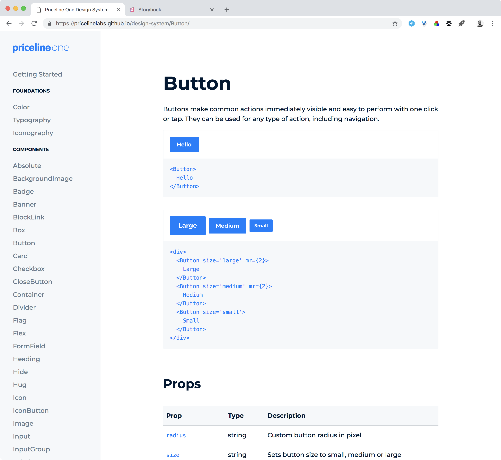
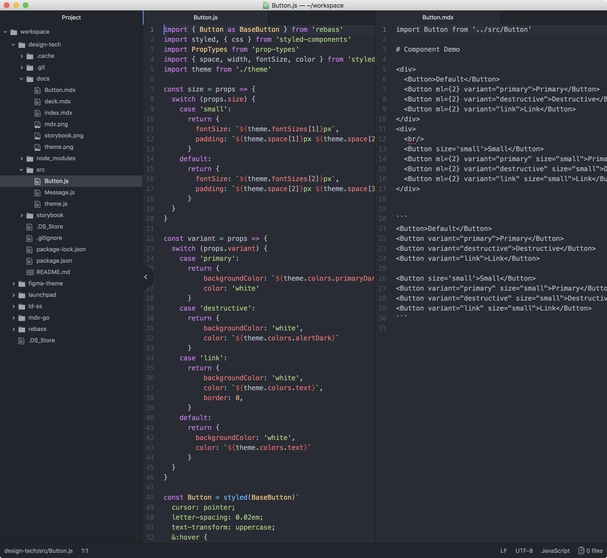
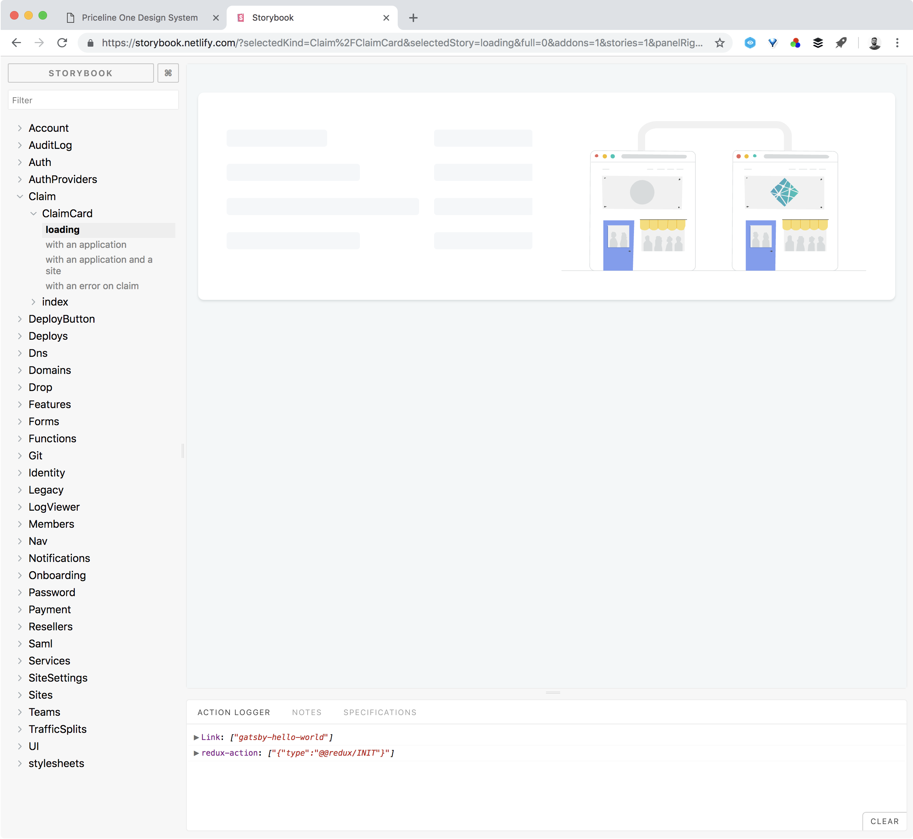

import { Head } from 'mdx-deck'
import { Image } from 'mdx-deck'
import { Invert, Split, SplitRight, FullScreenCode } from 'mdx-deck/layouts'
import Button from './src/Button'
export { dark as theme } from 'mdx-deck/themes'

<Head>
  <title>Design Technologies-Systems</title>
</Head>


# Design Systems
Approaches to design technologies
---
export default Invert

## Design systems outputs contain many types of outputs that communicate a range of guides to developers, designers and other users.
---
export default Split

## Launchpad offers

- Library: Documented guide to the system
- Package: Code repo of Utilities, Layouts, Components
- Sandbox: Stories of Patterns

---
export default SplitRight


## Library
A central site that lets users understand what all is available across the design system

#### Also see [Priceline](https://pricelinelabs.github.io/design-system/color/)
---
export default Invert

## Benefit
### Documents core design choices
### Fosters reuse/automation of design and development choices
---
<Button variant="primary" my={4}>Here it is</Button>

```jsx

# Button
Core button component

## Usage Guidelines
- Can be used in groups
- Can be used with pre or suff icons
- Comes in a limited set of variants

<div>
  <Button>Default</Button>
  <Button ml={2} variant="primary">Primary</Button>
  <Button ml={2} variant="destructive">Destructive</Button>
  <Button ml={2} variant="link">Link</Button>
</div>
```
---
export default SplitRight



## Package
A decoupled repo that holds the Library, Components and Stories
---
export default Invert

## Benefit
### Avoids shipment of org charts
### Drives uniformity across more triads regardless of team makeup
---
export default FullScreenCode

```jsx
import { space, width, fontSize, color } from 'styled-system'

const size = props => {
  switch (props.size) {
    case 'small':
      return {
        fontSize: `${theme.fontSizes[1]}px`,
        padding: `${theme.space[1]}px ${theme.space[2]}px`
      }
    default:
      return {
        fontSize: `${theme.fontSizes[2]}px`,
        padding: `${theme.space[2]}px ${theme.space[3]}px`
      }
  }
}

const Button = styled(BaseButton)`
  cursor: pointer;
  letter-spacing: 0.02em;
  text-transform: uppercase;
  &:hover {
    background-image: linear-gradient(rgba(0, 0, 0, 0.07), rgba(0, 0, 0, 0.07));
  }
  ${variant}
  ${size}
  ${space}
  ${color}
`

Button.defaultProps = {
  lineHeight: 1,
  theme: theme,
  as: 'button',
  fontWeight: '600',
  m: 0,
  border: 1,
  borderColor: 'border',
  borderRadius: 4,
}
```
---
export default SplitRight



## Sandbox
A component builder that holds old and new patterns alongside specs

#### Also see [Netlify](https://storybook.netlify.com)
---
export default Invert

## Benefit
### Avoids build errors in app _or_
### Previews and loosely manages patterns
---
export default Split

# Cadence

1. Discovery: Clarifies the use of an item
2. Design: Finalizes range of variations & states
3. Document*: Capture the how and when to use
4. Build*: Build the codified component
5. Publish: Versioning and merge into the Library

* *Overlaps across `/src` `/doc` & `/story`
---

## Library
## Util
## Layout
## Element
## Input
## Data
## Nav
## Story

---

### Design Tokens / Design Assets / Docsite
### Tokens / Icons
### 12 Col / Fractional / Flexbox / Rows / Modal / Drawer / Section / Card / Chart / Spacing
### Button / Tooltip / Message / Status / Chip / Tabs / Avatar / Marker
### Popover / Colorpicker / Multiselector / Datepicker / Checkbox / Radio / Toggle / Slider / Field / Search / Sort
### Content / Table / Graph / Progress
### Sidenav / Breadcrumb / Subnav
### Stories

---
# Some action items

1. Document discovery notes
2. Propose design system spec in Confluence
3. Draft multi quarter timeline
4. Run trial component cadence
